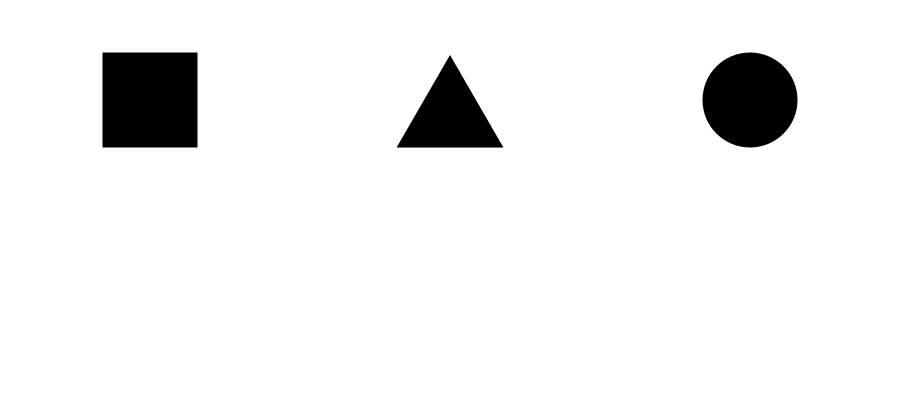
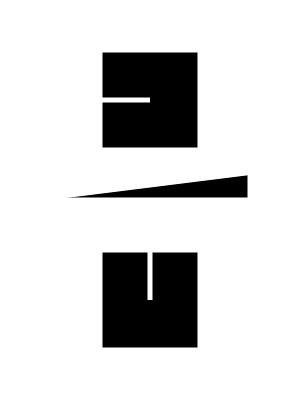

there is currently no main orthography and several systems exist. for the sake of convenience, latin script is used the most.
# latin
## consonants
consonants are written as they appear in the ipa, with a few exceptions:
- for cases where only ascii is allowed, /ŋ/ is written as ng 
- /fʰ/ and /sʰ/ are written as f and s (respectively)
- /x/ is written as h
- plosive codas are written as p, t and k (unvoiced forms)
- note that p/b, t/d and k/g are not distinguished as finals
	- for the purpose of standardisation, the former is preferred
## vowels
vowels are written as follows:

| light | neut | dark |
| :---: | :--: | :--: |
|   e   |  ə   |  i   |
|   a   |  ^   |  o   |
|   ō   |  ^   |  u   |

for cases where only ascii is allowed, vowels can be written as follows:

| light | neut | dark |
| :---: | :--: | :--: |
|   e   |  uh  |  i   |
|   a   |  ^   |  o   |
|  oh   |  ^   |  u   |

# syllabary
this is a hangul-inspired syllabary.
each syllable consists of the following:
- a shape on top to represent the initial
- a line in the middle to represent the medial and nucleus
- a shape at the bottom to represent the coda

## initial and coda
the initial and coda use the same shapes.
each shape consists of a base shape and a diacritic (line / dot).

the base shape is based on the placement of the consonant.
- square for bilabial consonants
- triangle for alveolar consonants
- circle for velar consonants

the diacritics are as follows:
- line going to the left for voiced plosives
- line going to the right for unvoiced plosives
- line going down for fricatives

in the case of plosives with no audible release functioning as finals, they are represented with a line going upwards to avoid leaning towards voiced/unvoiced plosives.

due to the fact that alveolar consonants are usually represented by a triangle, the diacritics look slightly different.

the main differences are that the line extends at a slightly different angle to meet the left and right lines of the triangle at their midpoints. there is also an extra diacritic, the dot, to represent l.

the top line still comes from the top, meeting the triangle at a corner instead of the midpoint of a line.

## medial and nucleus
the middle line can have 3 lines extending out from it.
- the line on the left represents the medial.
- the line in the middle represents the vowel class (high/mid/low).
- the line on the right represents the vowel group (dark/neut/light).

each line can either extend up or down, or not be present.

the medials w and y are represented with lines going up and down respectively.

the light vowels have a line going up on the right side. note that the middle line changes with the group (up for high, down for low).

the dark vowels are similar, but the line on the right side goes down instead.

the vowel ə can be represented as a neutral vowel (no line on the right side) in any class (any line in the middle), but for the sake of simplicity, the middle line is usually omitted.

